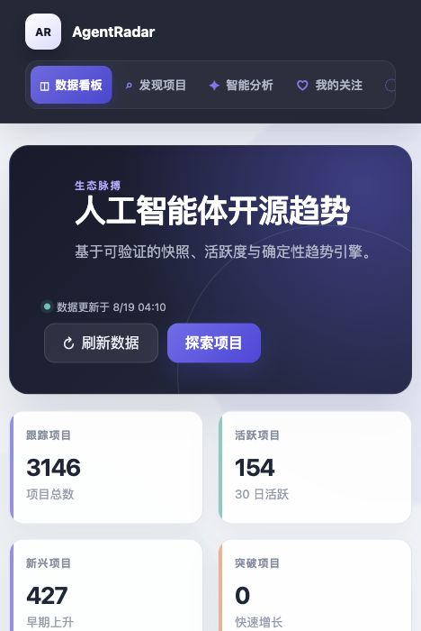
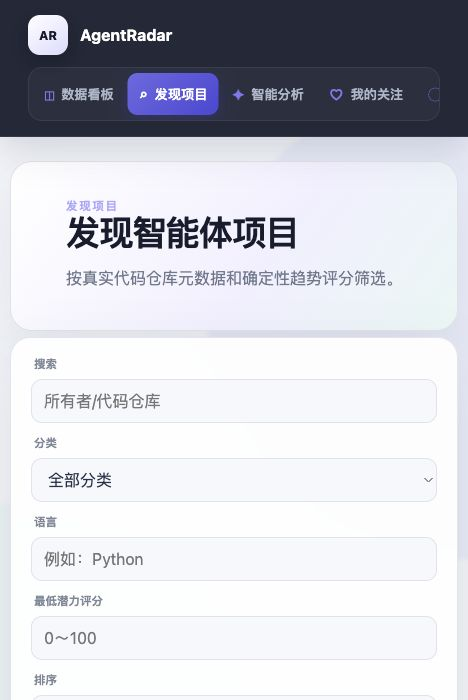
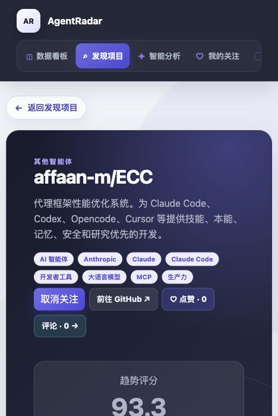
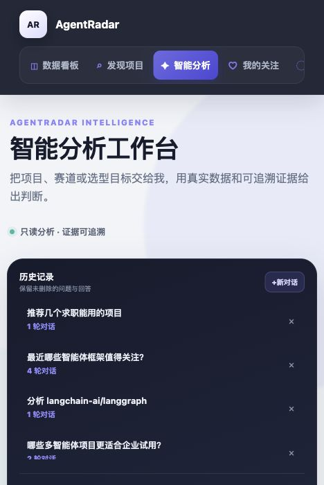
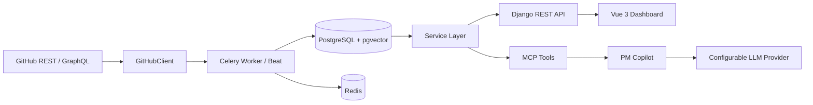

# AgentRadar

> 面向 GitHub AI Agent 开源生态的趋势分析与智能决策平台。

[](https://www.python.org/)
[](https://www.djangoproject.com/)
[](https://vuejs.org/)
[](https://www.postgresql.org/)
[](https://docs.docker.com/compose/)
[](LICENSE)

AgentRadar 持续采集真实 GitHub 公共数据，通过历史快照、确定性评分、经过门禁的机器学习模型和
可追溯知识证据，帮助开发者与产品团队发现、比较和评估 AI Agent 开源项目。

- 在线体验：[agentradar.site](https://agentradar.site)
- API 文档：[docs/API.md](docs/API.md)
- 系统架构：[docs/ARCHITECTURE.md](docs/ARCHITECTURE.md)

## 运行界面

| 数据看板 | 项目发现 |
| --- | --- |
|  |  |

| 项目详情 | 智能分析 |
| --- | --- |
|  |  |

## 核心能力

- **项目发现**：按分类、Topic、热度与结构化指标检索 AI Agent Repository。
- **持续采集**：Celery Beat/Worker 分层调度 GitHub Snapshot 与 Activity，支持限流、重试和幂等。
- **趋势与潜力**：Trend、Momentum、Potential、Hype Risk 等确定性评分，严格区分 `NULL` 与 `0`。
- **机器学习预测**：基于时间切分、数据质量门禁和 Model Registry 的 Logistic Regression、
  Random Forest、XGBoost 训练与评估；未通过验证的模型不会自动上线。
- **知识检索**：README、Docs、Release 等非结构化内容进入 pgvector，结构化指标始终从 PostgreSQL 查询。
- **PM Copilot**：通过 Skill → MCP → Tool → Service 链路编排分析，并返回可追溯 Evidence。
- **产品能力**：Dashboard、项目发现与详情、关注、提醒、日报/周报、点赞评论和管理员模型控制台。

## 系统架构



权威数值由数据库、确定性服务或已验证的模型产生。LLM 仅负责意图理解、工具编排与自然语言解释，
不会自行计算 Star、Trend、Potential 或 Forecast。

## 技术栈

| 层级 | 技术 |
| --- | --- |
| Backend | Python 3.12、Django、Django REST Framework、Gunicorn |
| Frontend | Vue 3、TypeScript、Vite、Pinia、Vue Router、ECharts |
| Data | PostgreSQL 16、pgvector、Redis |
| Async | Celery Worker、Celery Beat、Redis Lock |
| ML | scikit-learn、XGBoost、joblib、Time-based Split |
| AI | Provider abstraction、RAG、MCP、版本化 Skill |
| Delivery | Docker Compose、Nginx、GitHub Actions |

## 快速开始

### 前置要求

- Docker Engine 24+ 与 Docker Compose v2
- 可选：GitHub Token（提高公共 API 限额）
- 可选：兼容 OpenAI API 协议的 LLM Key（仅用于 Copilot 与翻译等 AI 功能）

### Docker Compose（推荐）

```bash
git clone <your-repository-url>
cd agentGitHub
cp .env.example .env
docker compose config --quiet
docker compose up -d postgres redis
docker compose run --rm backend python manage.py migrate --noinput
docker compose up --build -d
```

启动后访问：

- Frontend：<http://localhost:5173>
- Backend：<http://localhost:8000>
- Health：<http://localhost:8000/api/v1/health/>

`.env.example` 中只包含本地示例值。生产环境必须更换 Django Secret、数据库密码，并通过环境变量
注入 GitHub/LLM Key。不要把 `.env` 提交到 Git。

### 本地开发

需要 Python 3.12+ 与 Node.js 22+：

```bash
make install
make test
```

常用命令：

```bash
make lint
make backend-test
make frontend-test
make frontend-build
make compose-smoke
```

## GitHub 数据初始化

所有 GitHub 请求统一通过 `GitHubClient`。以下命令只用于显式初始化或单仓库同步：

```bash
cd backend
../.venv/bin/python manage.py discover_repositories --per-query 100 --pages-per-query 10
../.venv/bin/python manage.py sync_repository owner/repository
```

后台采集由 Celery 分层调度并遵守 GitHub Core/Search Rate Limit；Dashboard 不会在用户请求期间直接
实时抓取 GitHub。

## 目录结构

```text
agentGitHub/
├── backend/                 # Django API、Service、Celery、ML、MCP
├── frontend/                # Vue 3 Dashboard
├── skills/                  # PM Copilot 版本化工作流
├── docs/                    # 架构、API、数据、算法与运维文档
├── infra/                   # Nginx 配置
├── scripts/                 # 备份、恢复与生产 smoke 脚本
├── docker-compose.yml
└── Makefile
```

## 设计原则

- GitHub 数据只通过 `GitHubClient` 访问。
- Snapshot 使用 Redis Lock 与数据库唯一约束双重保护。
- Feature 只能使用 `sample_at` 及以前数据，Label 只能使用之后数据。
- Forecast 模型必须通过 Dataset Gate、Validation、Test 与人工激活。
- RAG 只保存非结构化知识，GitHub 内容始终视为不可信外部数据。
- Secret 不进入前端、日志、Evidence、文档或 Git 历史。

## 文档导航

- [架构](docs/ARCHITECTURE.md)
- [数据库](docs/DATABASE.md)
- [GitHub 数据采集](docs/GITHUB_COLLECTION.md)
- [Trend Engine](docs/TREND_ENGINE.md)
- [Potential Engine](docs/POTENTIAL_ENGINE.md)
- [Dataset](docs/DATASET.md)
- [Forecast Engine](docs/FORECAST_ENGINE.md)
- [RAG](docs/RAG.md)
- [MCP](docs/MCP.md)
- [Agent](docs/AGENT.md)
- [安全](docs/SECURITY.md)
- [测试](docs/TESTING.md)
- [部署](docs/DEPLOYMENT.md)

## 参与贡献

欢迎提交 Issue 和 Pull Request。开始前请阅读 [CONTRIBUTING.md](CONTRIBUTING.md) 与
[CODE_OF_CONDUCT.md](CODE_OF_CONDUCT.md)。安全问题请按 [SECURITY.md](SECURITY.md) 私下报告，
不要在公开 Issue 中披露漏洞、Token 或生产信息。

## 许可证

本项目采用 [MIT License](LICENSE)。第三方项目、数据与文档仍归其各自权利人所有。
